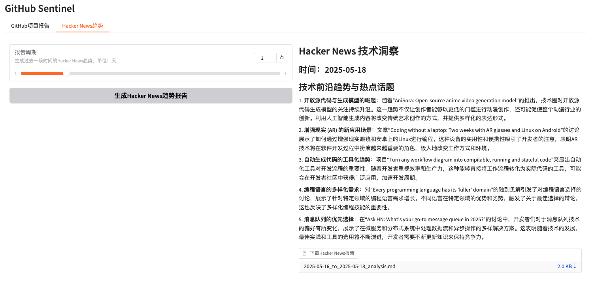

# GitHub Sentinel

<p align="center">
    <br> English | <a href="README.md">中文</a>
</p>

GitHub Sentinel is an open-source tool AI Agent designed for developers and project managers. It automatically retrieves and aggregates updates from subscribed GitHub repositories on a regular basis (daily/weekly) and provides trending technology analysis from Hacker News. Key features include subscription management, update retrieval, notification system, report generation, and technology trend monitoring.

## Features
- Subscription management
- Update retrieval
- Notification system
- Report generation
- Hacker News technology trend monitoring

## Getting Started

### 1. Install Dependencies

First, install the required dependencies:

```sh
pip install -r requirements.txt
```

### 2. Configure the Application

Edit the `config.json` file to set up your GitHub token, Email settings(e.g.Tencent Exmail), subscription file, and update settings:


```json
{
    "github_token": "your_github_token",
    "email":  {
        "smtp_server": "smtp.exmail.qq.com",
        "smtp_port": 465,
        "from": "from_email@example.com",
        "password": "your_email_password",
        "to": "to_email@example.com"
    },
    "slack_webhook_url": "your_slack_webhook_url",
    "subscriptions_file": "subscriptions.json",
    "github_progress_frequency_days": 1,
    "github_progress_execution_time":"08:00"
}

```
**For security reasons:** It is recommended to configure the GitHub Token and Email Password using environment variables to avoid storing sensitive information in plain text, as shown below:

```shell
# GitHub
export GITHUB_TOKEN="github_pat_xxx"
# Email
export EMAIL_PASSWORD="password"
```

### 3. How to Run

GitHub Sentinel supports the following three modes of operation:

#### A. Run as a Command-Line Tool

You can interactively run the application from the command line:

```sh
python src/command_tool.py
```

In this mode, you can manually enter commands to manage subscriptions, retrieve updates, and generate reports.

The command-line tool supports the following Hacker News related commands:
- `hn-export` - Export today's trending Hacker News articles
- `hn-export-range [days]` - Export trending Hacker News articles within the specified number of days
- `hn-generate` - Generate today's Hacker News trend analysis report
- `hn-generate-range [days]` - Generate Hacker News trend analysis report for the specified number of days

#### B. Run as a Background Service

To run the application as a background service (daemon), it will automatically update according to the configured schedule.

You can use the daemon management script [daemon_control.sh](daemon_control.sh) to start, check the status, stop, and restart:

1. Start the service:

    ```sh
    $ ./daemon_control.sh start
    Starting DaemonProcess...
    DaemonProcess started.
    ```

   - This will launch [./src/daemon_process.py], generating reports periodically as set in `config.json`, and sending emails.
   - The system will automatically generate both GitHub project update reports and Hacker News technology trend reports.
   - Service logs will be saved to `logs/DaemonProcess.log`, with historical logs also appended to `logs/app.log`.

2. Check the service status:

    ```sh
    $ ./daemon_control.sh status
    DaemonProcess is running.
    ```

3. Stop the service:

    ```sh
    $ ./daemon_control.sh stop
    Stopping DaemonProcess...
    DaemonProcess stopped.
    ```

4. Restart the service:

    ```sh
    $ ./daemon_control.sh restart
    Stopping DaemonProcess...
    DaemonProcess stopped.
    Starting DaemonProcess...
    DaemonProcess started.
    ```

#### C. Run as a Gradio Server

To run the application with a Gradio interface, allowing users to interact with the tool via a web interface:

```sh
python src/gradio_server.py
```

- This will start a web server on your machine, allowing you to manage subscriptions and generate reports through a user-friendly interface.
- The web interface includes two tabs:
  - **GitHub Project Reports**: Manage subscriptions and generate GitHub project update reports
  - **Hacker News Trends**: Generate technology trend analysis reports
- By default, the Gradio server will be accessible at `http://localhost:7860`, but you can share it publicly if needed.

#### D. Preview
